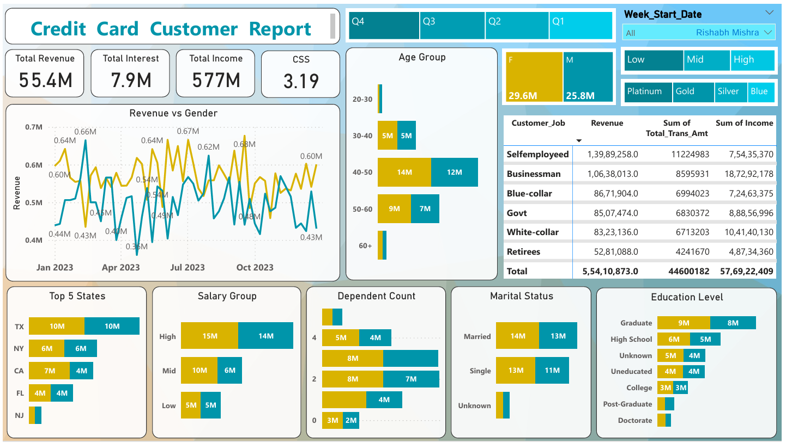

# Credit Card Financial Dashboard

**Tools:** SQL · Power BI  

---

## Overview
Built two interactive Power BI dashboards to track 
credit card performance and customer insights across 
a full year of transaction data.

---

## Key Numbers
| Metric | Value |
|---|---|
| Total Revenue | 55.4M |
| Total Interest Earned | 7.9M |
| Total Transaction Amount | 45M |
| Transaction Count | 657K |
| Total Customer Income | 577M |
| Customer Satisfaction Score | 3.19 |

---

## Transaction Dashboard Findings
- Blue card generates most revenue — 462M vs 
  Silver 55M, Gold 24M, Platinum 11M
- Bills are the biggest expenditure type at 14M
- Graduates bring in highest revenue at 22M
- Self-employed customers generate most revenue at 14M
- Swipe transactions dominate at 35M vs Chip 17M
- Q3 has highest transaction count at 166.6K

## Customer Dashboard Findings
- Age group 40-50 generates highest revenue
- Female customers generate slightly more — 29.6M vs 25.8M
- Texas and New York are top revenue states
- High salary group generates 15M vs Low 5M
- Married customers generate more revenue than single
- Revenue trends consistently between 0.4M and 0.7M weekly

---
## Dashboards

### Credit Card Transaction Report

---

### Credit Card Customer Report

---

## SQL Queries Covered
- Missing value checks across both tables
- Revenue by card category
- Weekly and quarterly revenue trends
- Age group and income group segmentation
- Delinquent account analysis
- Top spending states
- Customer job vs revenue breakdown
- Joined both datasets using Client_Num

---

## Files
| File | Description |
|---|---|
| credit_card_analysis.ipynb | SQL cleaning notebook |
| credit_card.csv | Raw transaction data |
| customer.csv | Raw customer data |
| credit_card_clean.csv | Final cleaned combined file |

---

## Tools
Python · Pandas · SQLite · Power BI · Jupyter Notebook

---

[LinkedIn](https://linkedin.com/in/priya-gupta13)
